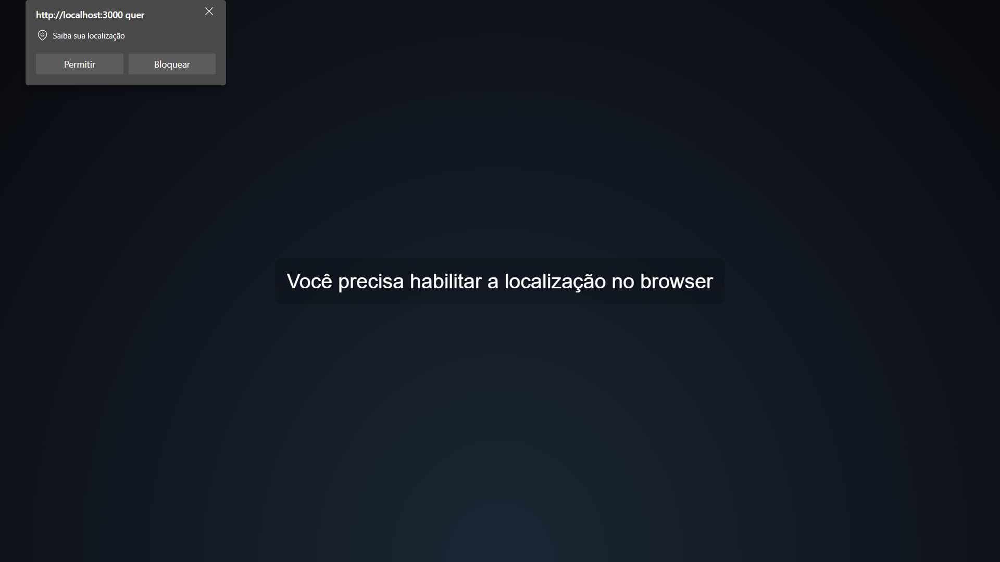
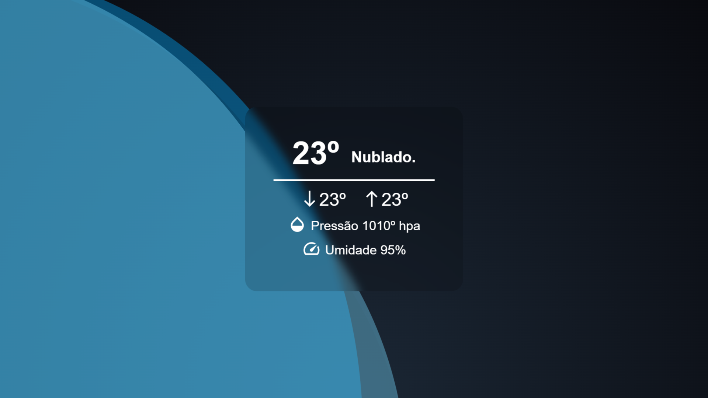
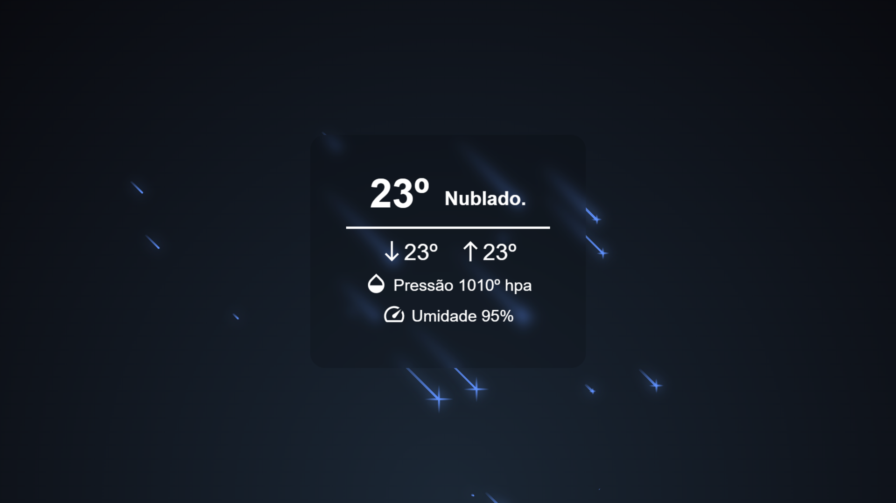

<h1 align="center">Previsão do Tempo</h1>

<p align="center">Fornecemos dados meteorológicos históricos precisos via API.</p>

<br />

## Screenshots

#### Permissão



#### Tela de fundo Matutino



#### Tela de fundo Noturno



<br />

## Rodando a Aplicação

<a href="https://matheuspalmieri-weatherforecast.netlify.app/" target="_blank">Acesso o site do Projeto, clicando aqui.</a>

```
https://matheuspalmieri-weatherforecast.netlify.app/
```

<br />
<i>Siga as etapas para rodar o Projeto em sua máquina local.</i>
<br />

#### Requirimentos

- [Node](https://nodejs.org/en/)
- [Yarn](https://classic.yarnpkg.com/lang/en/) or [Npm](https://www.npmjs.com/)

#### Clone o repositório e acesse a pasta

```
$ git clone https://github.com/MatheusPalmieri/weather-forecast && cd weather-forecast
```

#### Instalando as dependências necessárias

```
$ npm install or yarn
```

#### Rodar projeto local

```
$ npm start or yarn start
```

<i>Abra o browser na página "http://localhost:3000" para visualizar.</i>

<br />

## Tecnologias

<p>As seguintes ferramentas foram usadas na construção do projeto:</p>

**Frontend**: React, JavaScript, HTML e CSS.
<br />
**Api**: OpenWeather.

<br />

## Licença

Este projeto está licenciado sob a [Licença MIT](LICENSE).

<br />

## Autor

Create for <b>`Matheus Palmieri`</b>👨‍💻

<br />

<p align="center">🌧️ Weather Forecast V1.1.0 🚀</p>
