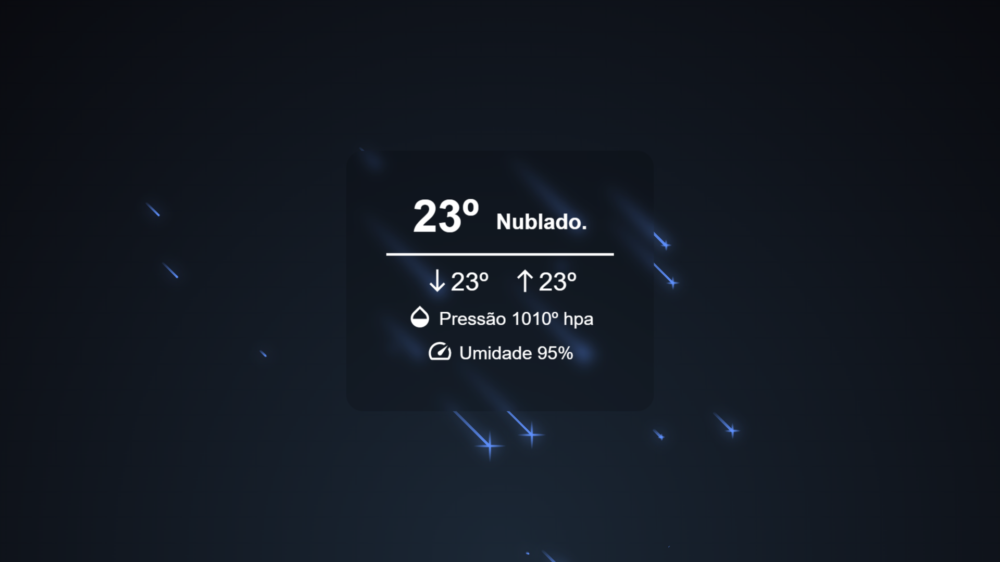

<!-- Título -->

<h1 align="center">Weather API</h1>

<!-- Descrição -->

<p align="center">Através da API, fornecemos dados meteorológicos históricos para o local da máquina do usuário.</p>

<!-- Súmario -->

<p align="center">
 <a href="#demo">Demo</a> •
 <a href="#rodando-a-aplicação">Rodando A Aplicação</a> •
 <a href="#tecnologias">Tecnologias</a> •
 <a href="#autor">Autor</a>
</p>

<br>

---

<br>

## Demo

<br>

<p>Permissão</p>


<br>

<p>Aviso de carregamento</p>


<br>

<p>Noturno Screen</p>


<br>

<p>Matutino Screen</p>


---

<br>

## Rodando A Aplicação

<a href="https://matheuspalmieri-weatherapi.netlify.app/" target="_blank">Acesso o site do Projeto, clicando aqui.</a>

```
https://matheuspalmieri-weatherapi.netlify.app/
```

<br>

### Requirimentos

- [Node](https://nodejs.org/en/)
- [Yarn](https://classic.yarnpkg.com/lang/en/) or [Npm](https://www.npmjs.com/)

<br>

### Clone o repositório e acesse a pasta
```
$ git clone https://github.com/MatheusPalmieri/weather-api && cd weather-api
```

<br>

### Siga as etapas para rodar o Projeto em sua máquina local
```
# Para instalar as dependências necessárias
$ npm install

# Para startar projeto
$ npm start

Abra o browser na página "http://localhost:3000" para visualizar.

```
<br>

---

<br>

## Tecnologias

As seguintes ferramentas foram usadas na construção do projeto:

- [React](https://pt-br.reactjs.org/)
- [JavaScript](https://www.javascript.com/)
- [CSS](https://html.com/css/)
- [Axios](https://axios-http.com/)

<br>

---

<br>

### Autor

Create for <b>`Matheus Palmieri`</b>👨‍💻

<br>
<br>

<p align="center">🎉Test Weather API Finalizado🚀</p>
